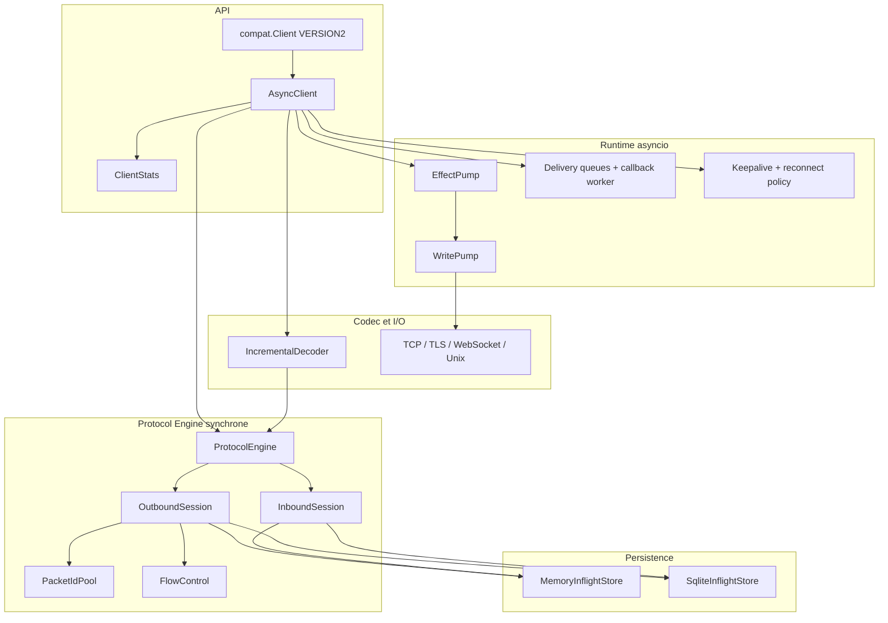

# Design — mqttium

Objectif : implémentation MQTT Python de référence — async-native, correcte,
performante, avec une façade de migration compatible Paho VERSION2.

## Cibles

| Axe | Cible |
| --- | --- |
| Protocoles | MQTT 3.1.1 et 5.0 |
| Python | 3.11 à 3.14 |
| Runtime | `asyncio` natif ; thread dédié uniquement dans l’adaptateur Paho |
| Transports | TCP, TLS, WebSocket et Unix |
| Correctness | machines QoS 1/2 complètes ; Receive Maximum ; DUP/dedup |
| Mémoire | admission, writer, ingress et livraison bornés |
| API | `AsyncClient`, diagnostics immuables et façade Paho additive |
| Licence | Apache-2.0 (from-scratch ; voir `LICENSE`) |

## Architecture



### Règle d’or

`ProtocolEngine` ne connaît **ni** `asyncio`, **ni** sockets, **ni** callbacks
utilisateurs. Il consomme des `IncomingPacket` et produit des
`EngineEffect` (paquets à émettre, événements applicatifs, transitions).

### Application ordonnée des effets

`AsyncClient` interprète les `EngineEffect` parce qu'il possède le transport,
les futures, les receipts, les callbacks et les files de livraison. L'état de
sérialisation de cette interprétation appartient toutefois à `EffectPump`
(`api/_effects.py`) : deque ordonnée, epoch de connexion, compteurs de progrès
et worker de flush.

Le cas nominal d'un seul effet immédiatement applicable ne passe jamais par la
deque, les compteurs ou un task : `AsyncClient` lie directement les opérations
du pump sur l'instance et l'effet est appliqué inline. Les effets asynchrones
seuls sont tagués par epoch et repris par le worker. Les anciens attributs de
diagnostic d'`AsyncClient` sont des vues en lecture, pas un second état.

### Writer et backpressure réseau

La file de transport, son budget en octets/messages, la condition de réveil,
le task writer, le batching/coalescing et `last_outbound` appartiennent à
`WritePump` (`api/_writer.py`). `AsyncClient` conserve le transport, l'epoch de
connexion et la politique de panne : le pump signale une erreur, le client
notifie alors le moteur, solde les receipts si nécessaire et ferme le transport.

Les opérations `can_enqueue_size`, `try_enqueue` et `enqueue` sont liées
directement sur l'instance `AsyncClient`, comme celles d'`EffectPump`, afin de
ne pas ajouter un wrapper au chemin SEND. L'algorithme de batch reste inchangé :
256 items maximum, coalescing des frames contiguës, écriture segmentée sans
copie des gros payloads et réveil des producteurs seulement après restitution
du budget. Les anciens attributs privés du client sont des vues de compatibilité
pour les tests et l'instrumentation, jamais un second état.

### Ingress borné et observabilité

Le read loop traite au maximum 256 paquets et une cible configurable
`max_ingress_batch_bytes` avant d'appliquer les effets et de propager la
backpressure de livraison. Le paquet qui atteint la cible reste inclus, afin
qu'un paquet individuellement plus grand puisse toujours progresser.

`AsyncClient.stats()` construit à la demande un arbre `ClientStats` immuable.
Chaque section est produite par le composant qui possède l'état, et `stats()` ne
fait que les assembler : `OutboundSession.stats()`, `InboundSession.stats()`,
`EffectPump.stats()`, `WritePump.stats()` et `transport.stats()`. Le client ne
traverse donc plus `outbound._queued`, `inbound._inflight` ni les attributs d'un
transport : un champ privé peut évoluer sans le toucher, et chaque propriétaire
calcule ses propres invariants au même endroit. Un transport tiers qui
n'implémente pas `stats()` est rapporté via `TransportStats.unavailable()`.

Les types de snapshot vivent chez leur propriétaire — `protocol/stats.py` et
`transport/stats.py` — pour que la dépendance continue d'aller de l'adaptateur
runtime vers le cœur, et non l'inverse. `api/stats.py` les réexporte.

Aucun logger, sampler périodique ou registre parallèle n'est ajouté. Les
high-water marks du writer sont relevés par batch dans le worker, et non sur
chaque admission du hot path. Les compteurs de décision (`batches`,
`multi_effect_batches`, `reordered_batches`, `inline_effects`,
`segmented_writes`, `enqueue_suspensions`, …) existent pour qu'une modification
du batching writer ou de la représentation des lots d'effets s'appuie sur des
mesures plutôt que sur une intuition ; leur coût est vérifié par
`paired_regression.py`.

### Commandes loop-bound et façade Paho

`AsyncClient.publish_nowait()` est une primitive synchrone mais attachée au
thread de l'event loop, analogue à `asyncio.Queue.put_nowait()`. Elle partage
l'admission, la création des receipts et l'application coalescée des effets
avec `publish()`, sans créer de coroutine. Elle n'est volontairement pas une
API thread-safe : la façade Paho garde sa file inter-thread bornée et commit
un batch sur le loop avant de finaliser les effets une seule fois.

La façade Paho ne touche plus directement `ProtocolEngine`, les registres de
receipts ou `EffectPump`. Elle passe par une petite frontière interne
loop-confined d'`AsyncClient`, afin de préserver le batching et les fast paths
sans introduire de bus de commandes générique. Le chemin natif
`await publish()` garde volontairement l'admission, la création du receipt et
le drainage inline : le faire passer par ces wrappers a mesuré 2,36 % plus lent
sur le contrôle apparié, au-delà du budget de régression.

### Découpage interne du moteur

`ProtocolEngine` orchestre la machine d'état de connexion et le dispatch des
paquets. Toute la publication sortante appartient à `OutboundSession`
(`protocol/outbound.py`), qui possède seul :

- le budget d'admission (`max_pending_outbound_messages` / `_bytes`) ;
- le `PacketIdPool` (partagé : le moteur y alloue aussi les MID SUB/UNSUB) ;
- la fenêtre `FlowControl` ;
- la file `_queued` des messages en état `QUEUED` ;
- les enregistrements sortants du store, le replay et la ré-hydratation.

Une publication QoS 1/2 acquiert quatre ressources — budget, MID, ligne de
store, slot de flow — et un seul composant les acquiert et les restitue, ce qui
est la raison d'être de l'extraction.

`OutboundSession` ne possède **pas** l'état de connexion : il relit `state` et
`negotiated` depuis le moteur (tous deux réassignés à chaque connexion) et émet
via `ProtocolEngine._emit` / `_send`, jamais dans une liste d'effets à lui.
L'ordre relatif des effets sortants et des effets de connexion est observable
par `AsyncClient` — notamment les `PUBLISH_FAILED` de purge émis **avant**
l'effet `CONNACK` lorsque le broker a jeté la session.

Toute la réception PUBLISH appartient symétriquement à `InboundSession`
(`protocol/inbound.py`), qui possède seul :

- les alias de topic entrants, remis à zéro à chaque connexion réseau ;
- le compteur local `Receive Maximum` ;
- les enregistrements QoS 1/2 entrants du store ;
- le suivi `delivered` / `user_acked`, l'ACK manuel et le replay après restart.

Les handlers `PUBLISH` et `PUBREL` pointent directement sur cette session.
Symétriquement, `PUBACK`, `PUBREC` et `PUBCOMP` pointent directement sur
`OutboundSession`, de sorte que le propriétaire des budgets, MID, lignes de
store et slots de flow contrôle aussi leur libération terminale. Les deux
sessions émettent dans l'unique flux d'effets du moteur et ne possèdent pas
l'état de connexion.

### Contrat de persistance : transitions conditionnelles

`InflightStore` reste l'interface minimale « objets complets ». Deux extensions
optionnelles, résolues une seule fois par session via `isinstance` :

- `PagedInflightStore` — pagination du replay (`out_pages`,
  `out_summary_pages`, `in_pages`) ;
- `TransitionInflightStore` — transitions **atomiques, conditionnelles et sans
  payload** (`complete_out`, `transition_out`, `contains_in`, `in_meta`,
  `mark_in_delivered`, `transition_in`, `complete_in`, `in_index_pages`,
  `set_out_logical_size`).

Le store ne possède jamais la machine d'état : `expected_state` et `new_state`
viennent toujours de la session, et le store garantit seulement l'atomicité de
la mutation, en renvoyant `None` quand l'enregistrement est absent ou n'est plus
dans l'état attendu. Un store tiers qui n'implémente pas ces protocoles continue
d'utiliser le chemin objet complet : correct, simplement plus coûteux.

Conséquence directe : un `PUBACK` pour une publication de plusieurs mégaoctets
ne relit plus le BLOB pour supprimer sa ligne. La comptabilité du budget repose
alors sur `logical_size`, désormais persisté (schéma SQLite 2) ; les
enregistrements écrits par un schéma antérieur le voient recalculé une fois à
l'hydratation, puis réécrit.

### Schéma durable versionné

`SqliteInflightStore` inscrit sa révision dans `PRAGMA user_version`
(`SQLITE_SCHEMA_VERSION`). L'ouverture migre en **une seule transaction** : une
migration interrompue rouvre dans la version de départ, jamais dans un état
intermédiaire. Une base écrite par une version plus récente est refusée.

`batch()` est paresseux : `BEGIN IMMEDIATE` n'est émis qu'à la première
mutation, de sorte qu'un lot d'ingress purement lecture (QoS 0, PINGRESP, ACK
sans effet) ne prend aucun verrou d'écriture et ne paie aucun commit.

### Ordre des colonnes et pagination ordonnée

Deux décisions de stockage, mesurées plutôt que supposées.

**`payload` est déclaré en dernier.** SQLite atteint une colonne en parcourant
celles déclarées avant elle, et un payload de quelques centaines d'octets
déborde en pages d'overflow. Toute colonne de métadonnées placée après
`payload` coûtait donc un parcours d'overflow sur une lecture qui ne voulait
pas le payload — y compris le `SELECT state, logical_size` de chaque `PUBACK`.

**Aucun index sur `seq`.** La pagination ordonnée n'utilise pas
`WHERE seq>? ORDER BY seq LIMIT ?` réémis par page : cette forme rescanne et
retrie la table à chaque page, ce qui rendait un replay complet quadratique. À
la place, `_ordered_mids()` fait **une seule passe triée sur les métadonnées**
(8 octets par enregistrement, soit moins d'un demi-mégaoctet pour 60 000
enregistrements), puis chaque page est relue par clé primaire.

Mesuré sur 10 000 enregistrements de 4 Kio :

| variante                                 | publish+ACK/s | lag p95 | replay sortant | replay entrant | démarrage |
| ---------------------------------------- | ------------: | ------: | -------------: | -------------: | --------: |
| index `seq` (les deux)                   |         2 885 | 192,7 ms |        970,6 ms |        171,6 ms |   130,5 ms |
| index `inbound(seq)` seul                |         6 165 |  24,9 ms |       1004,9 ms |        168,9 ms |   135,0 ms |
| **aucun index (retenu)**                 |     **6 138** | **25,5 ms** |    **981,6 ms** |    **174,4 ms** |  **151,9 ms** |

Avec le schéma `payload`-en-dernier, les index n'apportent plus rien au replay
ni au démarrage, et coûtent la moitié du débit de publication durable ainsi
qu'un lag p95 7,7× pire. `benchmarks/persistence_index_ab.py` recrée les trois
variantes pour que cette décision reste réfutable.

Conséquence sur le contrat de pagination : les identifiants sont figés au début
de l'itération, donc une page dont des enregistrements ont été acquittés entre
temps revient **plus courte**. C'est déjà le comportement de
`MemoryInflightStore` ; la garantie due à l'appelant est identique des deux
côtés — ordre d'insertion préservé, ni doublon ni résurrection.

### Replay entrant incrémental

`InboundSession.replay_session()` n'émet plus toutes les redélivrances d'un
coup. Il restaure d'abord la fenêtre `Receive Maximum` à partir de l'index
(`in_index_pages`, sans payload), puis émet un lot borné (messages, octets et
enregistrements parcourus) suivi d'un effet interne
`CONTINUE_INBOUND_REPLAY`. `AsyncClient` applique ce marqueur en rentrant
brièvement sous `_engine_lock` et en demandant le lot suivant.

La backpressure de livraison s'exerce donc **entre** les lots, et le pic mémoire
devient proportionnel à un lot au lieu de la session entière (mesuré : 5,9 Mio →
0,76 Mio sur 4 000 messages de 1 Kio). L'effet de continuation porte l'époque de
connexion comme tous les autres : une déconnexion en cours de replay l'élimine,
et le curseur est abandonné au prochain `begin_connect()`.

## Modules

```text
mqttium/
├── docs/                 # ANALYSIS, DESIGN, ROADMAP, AUDIT
├── src/mqttium/
│   ├── __init__.py
│   ├── enums.py
│   ├── errors.py
│   ├── types.py
│   ├── codec/            # VBI, buffer, primitives UTF-8/bin
│   ├── packets/          # types + encode/decode par paquet
│   ├── protocol/         # engine, inbound/outbound, effects, config, ids, flow
│   ├── transport/        # TCP/TLS (WS plus tard)
│   ├── persistence/      # memory (+ sqlite plus tard)
│   ├── dispatch/         # matcher, callbacks
│   ├── api/              # AsyncClient, models
│   └── compat/           # notes + façade Paho (progressive)
├── tests/
│   ├── unit/             # engine/codec sans réseau
│   └── integration/      # broker optionnel
├── examples/
└── benchmarks/           # réutiliser idées du harness Paho
```

## Contrats clés

### IncrementalDecoder

- Buffer `bytearray` + offset de lecture ; compaction bornée.
- Lit d’abord fixed header + Remaining Length (max 4 octets).
- Si `maximum_packet_size` négocié / local est dépassé → erreur protocole.
- Paquet contigu → parse par index / `unpack_from` / `memoryview`.
- Paquet à cheval → fallback incrémental (état slots, pas dict).
- **Ne jamais** exposer un `memoryview` du buffer réutilisable à l’API.

### PacketIdPool

- Espace `1..65535`, indépendant de Receive Maximum.
- Un pool **par client** ; les MID entrants ne sont **jamais** `free()` dans
  le pool sortant.
- Séparer clairement : IDs sortants (PUBLISH/SUB/UNSUB) vs tracking entrant QoS2.
- Optimisation mémoire : quand le pool se vide, `release()` **rebind** ses
  conteneurs et remet `_next = 1` au lieu de les `clear()`, afin de rendre la
  capacité de hachage accumulée sous charge. Conséquence : un client à un seul
  message en vol réutilise en permanence le MID 1. **La sûreté repose alors
  entièrement** sur deux invariants de correction, à ne jamais casser
  ensemble :
  1. le moteur émet `PUBLISH_COMPLETE` / `PUBLISH_FAILED` **avant** de libérer
     le MID (`_on_puback` / `_on_pubrec` / `_on_pubcomp`) ;
  2. le client indexe les receipts en FIFO par MID
     (`_register_publish_receipt` / `_pop_publish_receipt`).
  Sans eux, un ACK tardif réglerait le receipt d’une publication ultérieure
  ayant recyclé le même identifiant.

### Admission sortante (mémoire logique)

- Deux compteurs moteur bornent les publications QoS 1/2 non terminées :
  `max_pending_outbound_messages` et `max_pending_outbound_bytes`. La taille
  logique est `payload + topic UTF-8 + propriétés PUBLISH encodées` ; aucun
  surcoût fixe par objet n’est facturé.
- Ordre obligatoire dans `queue_publish` : validation de taille → calcul de la
  taille logique → **réservation** → allocation du MID → écriture store. Un
  refus est donc atomique.
- `queue_publish_many` snapshote les deux compteurs à l’entrée et les
  **restaure intégralement** en rollback : un store transactionnel
  (`SqliteInflightStore.batch()`) annule ses écritures avant que la clause
  `except` ne s’exécute, donc les tailles par enregistrement sont déjà perdues
  à cet instant.
- `can_ever_admit_publish()` ne regarde que les limites **configurées**, jamais
  l’état courant : il distingue « attendre » de « jamais admissible ».
- Côté client, un producteur garé sur la capacité ne détient aucun receipt.
  C’est `_publish_wait_failure()` qui le fait échouer lorsque la connexion est
  définitivement perdue — la capacité n’étant libérée que par un acquittement,
  il attendrait sinon indéfiniment. Une reconnexion en cours n’est pas
  terminale : la session rejouée finira par solder le budget.

### Budget de livraison entrante

- `max_pending_delivery_bytes` est **partagé** entre l’itérateur et les
  callbacks. Un message est facturé une seule fois et libéré quand la dernière
  référence disparaît (`Message._delivery_references`).
- Une fraction (1/8) du budget est réservée aux petits messages, pour qu’un gros
  payload ne puisse pas affamer la télémétrie. La partition est désactivée
  automatiquement si elle réduirait la capacité pour un paquet unique.

### Persistance entrante bornée

- `max_pending_inbound_bytes` borne les données applicatives que le protocole
  doit conserver pour les handshakes QoS 2 et QoS 1 avec `manual_ack=True`.
  La taille logique est `payload + topic UTF-8 + propriétés PUBLISH encodées`.
- La réservation est effectuée avant l’écriture du store. Une retransmission du
  même MID réutilise la réservation existante; la transition qui supprime
  réellement l’enregistrement la libère exactement une fois.
- `inbound.logical_size` (schéma SQLite 4) permet de restaurer et solder le
  budget sans lire le payload. Les lignes historiques de taille nulle sont
  hydratées et backfillées une seule fois à l’ouverture.
- Dépasser le quota produit MQTT 5 `DISCONNECT 0x97`; MQTT 3.1.1 ne disposant
  pas de code de raison équivalent, la connexion est fermée.

### Epochs de connexion

- Chaque effet moteur porte l’epoch de la connexion qui l’a produit. À la
  déconnexion l’epoch est incrémenté et les effets périmés sont rejetés : c’est
  ce qui empêche du travail en vol d’une connexion morte de toucher la
  suivante.

### FlowControl

- Fenêtre inflight sortante = `min(local_max, broker_receive_maximum)`.
- Compte uniquement PUBLISH QoS 1/2 non terminés.
- API native : attendre (async) plutôt que lever `OverflowError` par défaut ;
  mode « raise » disponible pour compat.

### QoS 2 outbound

```text
QUEUED → SEND_PUBLISH → WAIT_PUBREC → SEND_PUBREL → WAIT_PUBCOMP → DONE
```

- Sur PUBREC succès : remplacer l’enregistrement persistant par PUBREL (pas
  supprimer le MID).
- Libérer MID uniquement après PUBCOMP (ou erreur terminale).
- Retransmit : positionner DUP sur PUBLISH ; rejouer PUBREL si phase 2.

### QoS 2 inbound

```text
RECV_PUBLISH → DELIVER_ONCE → SEND_PUBREC → WAIT_PUBREL → SEND_PUBCOMP → DONE
```

- Dédupliquer sur MID tant que PUBREL non reçu.
- PUBLISH DUP : ne pas redélivrer à l’application si déjà délivré.

### Session / reconnect

- `session_present=0` → purger inflight local sortant non encore « sessionné »
  selon clean start / session expiry.
- `session_present=1` → rejouer dans l’ordre, en drains bornés
  (ex. 64 paquets / 64 KiB) — leçon audit §17.
- Alias topic : table vidée à chaque **connexion réseau** (pas seulement
  session).
- Politique reconnect : backoff + jitter ; stop sur reason codes définitifs
  (auth, banned, …) ; timeout CONNECT/CONNACK.

### Callbacks

- Snapshot avant dispatch.
- Hors verrou / hors section critique engine.
- Sync et async supportés uniformément.
- Callback lent ne doit pas corrompre l’état ; backpressure / isolation
  documentée (phase 2 : file bornée optionnelle).

## API AsyncClient (v0)

```python
class AsyncClient:
    async def connect(self, host: str, port: int = 1883, *,
                      keepalive: int = 60, ssl: ...) -> ConnAck
    async def disconnect(self, reason_code: int = 0) -> None
    async def publish(self, topic: str, payload: bytes = b"", *,
                      qos: int = 0, retain: bool = False,
                      properties: Properties | None = None) -> PublishReceipt
    async def subscribe(self, topic: str | list, *, qos: int = 0,
                        options: SubscribeOptions | None = None) -> SubAck
    async def unsubscribe(self, topic: str | list) -> UnsubAck
    def messages(self) -> AsyncIterator[Message]
    # callbacks optionnels: on_connect, on_message, on_disconnect, ...
```

`PublishReceipt.wait()` attend l’achèvement protocole (QoS0 = accepté par la
file du writer unique, sans garantie réseau ; QoS1 = PUBACK ; QoS2 = PUBCOMP).
Les sorties passent toutes par **un seul task writer** alimenté par une file
FIFO : l’ordre wire est celui des effets du moteur, quel que soit le nombre de
coroutines qui publient (voir `IMPLEMENTATION-GUIDE.md` §1).

## Compat Paho

Stratégie progressive (voir ROADMAP) :

1. Documenter le mapping API.
2. Adapter sync threadé au-dessus d’`AsyncClient` (un loop dédié).
3. Emuler `CallbackAPIVersion.VERSION2`.
4. Helpers `publish.single/multiple`, `subscribe.simple`.

Ne **pas** viser 100 % de compat byte-for-byte des quirks historiques
(`clean_session` republication non conforme) — documenter les écarts.

## Performance — budget de conception

Appliquer dès le code initial (pas « plus tard ») :

1. Decoder contigu + read-ahead borné.
2. Encoder `bytearray` + fast path Remaining Length < 128.
3. Empty properties fast path MQTT 5.
4. `dict` ordonné pour inflight.
5. Wakeup/coalesce si façade threadée.
6. Payload segmenté au-delà d’un seuil (1 MiB).
7. Callback path sans matching si aucun filtre enregistré.
8. Imports lourds (proxy, WS) différés.

Chaque optimisation ultérieure doit passer un microbench + garde-fou
régression avant merge.

## Tests obligatoires (correctness)

- Fragmentation byte-à-byte et multi-paquets par chunk.
- VBI malformé / overflow taille.
- QoS 2 toutes phases + reconnect entre chaque phase.
- DUP / déduplication inbound.
- Receive Maximum (blocage puis reprise).
- session_present 0/1.
- Propriétés MQTT 5 : contexte paquet, cardinalité, UTF-8 interdit.
- Keepalive / server_keep_alive.
- Annulation `connect()` / `publish().wait()`.
- Concurrence publish pendant callback.

## Hors scope v0

- Bridge mode Paho.
- Plugins AUTH concrets (SCRAM, OAuth) — l’API `auth_handler` est fournie.
- Proxy SOCKS (import différé plus tard).
- Alias automatiques.
- Free-threading production guarantees (mais éviter les globaux mutables).
