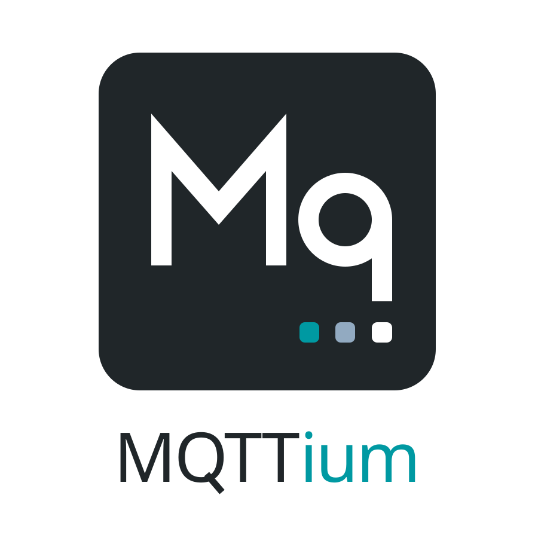

# MQTTium documentation

  

MQTTium is a dependency-free, async-native MQTT 3.1.1 and MQTT 5 client for
Python 3.11–3.14. It is built for production services, gateways, and connected
devices that need explicit completion, bounded resource use, and reliable
recovery.

These pages describe the current source API, not the published `1.0.0rc14`
package. Follow the [source installation instructions](getting-started.md)
to run the examples, or select documentation for your installed release.

## Choose a path

-   :material-rocket-launch-outline: **Build a native client**

    ---

    Install MQTTium and complete a publish/subscribe round trip with
    [`AsyncClient`](getting-started.md).

-   :material-tune-variant: **Prepare for production load**

    ---

    Choose explicit limits in [Configuration and Sizing](configuration-and-sizing.md), then
    use [Operations and Observability](operations.md) to diagnose pressure.

-   :material-database-sync-outline: **Recover across failures**

    ---

    Combine broker session retention, reconnect, and optional SQLite inflight
    state in [Sessions and Persistence](sessions-and-persistence.md).

-   :material-swap-horizontal: **Migrate an existing client**

    ---

    Review the breaking changes in the [migration guide](migration.md).
    The current native API removes the Paho façade and one-shot helpers.

## What the native client provides

| Area | Behaviour |
| --- | --- |
| Protocol | MQTT 3.1.1 and MQTT 5; QoS 0, 1, and 2 |
| Completion | Per-message and aggregate receipts tied to MQTT semantics |
| Flow control | Independent message and byte bounds for protocol, writer, ingress, and delivery state |
| Recovery | Jittered reconnect, broker-session resumption, and optional persistent inflight state |
| Delivery | Async iterator, with optional manual acknowledgement, or short synchronous auto-ack callbacks |
| Transports | TCP, TLS, WebSocket, and Unix-domain sockets |
| Operations | Immutable snapshots and broker-negotiated limits without a background sampler |
| Packaging | Typed Python package with no runtime dependencies |

Start with [Core Concepts](core-concepts.md) for the completion, ownership, and
backpressure model that distinguishes MQTTium from a minimal MQTT wrapper.

## Documentation map

- **Guides** solve application tasks: configuration, sessions, transports,
  MQTT 5, operations, troubleshooting, and complete recipes.
- **Reference** records the native imports, signatures, defaults, exceptions,
  compatibility tiers, and validated environments.
- **Concepts** explain architecture, protocol ownership, conformance, and the
  no-library-logging decision.
- **Maintainer material** defines benchmarking, fuzzing, stability, and release
  evidence requirements.
- **Historical evidence** preserves dated reports without presenting their old
  measurements or conclusions as current behaviour.

## API support tiers

Native client operations, models, receipts and results are Stable.
Statistics and the two shipped stores are Provisional. Engine, codecs,
transport implementations, records and extension protocols are Internal.
See the [API Stability Policy](api-stability.md) for exact tiers and import paths.

## Trust and evidence

Protocol behaviour is checked with unit, integration, property, fuzz, memory,
and broker-interoperability tests. Packaging checks install wheel and source
artifacts in isolation. Performance claims require the reproducible controls in
the [Benchmarking Contract](benchmarking.md).

Current contracts live in the main documentation. Dated audits and campaign
records live in the [Historical Evidence index](reports/README.md); report
bodies are immutable records of the commit they name.
